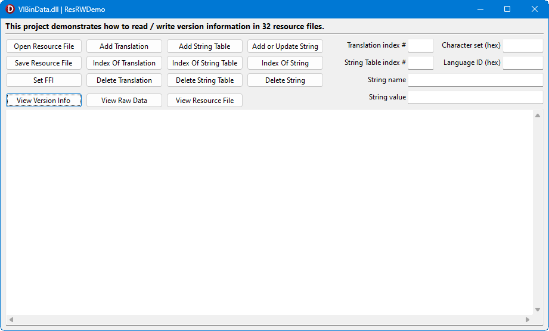

# vilib Demo Programs

## Contents

* [Introduction](#introduction)
* [Compiling and Configuration](#compiling-and-configuration)
* [Using `ResRWDemo`](#using-resrwdemo)
    * [Use the source code](#use-the-source-code)
    * [How to view the state of the version information object](#how-to-view-the-state-of-the-version-information-object)
    * [Create the resource file](#create-the-resource-file)
    * [Create the fixed file information](#create-the-fixed-file-information-ffi)
    * [Create the translations](#create-the-translations)
    * [Modify the translations](#modify-the-translations)
    * [Create the string tables](#create-the-string-tables)
    * [Modify the string tables](#modify-the-string-tables)
    * [Create the string values](#create-the-string-values)
    * [Modify strings](#modify-strings)
    * [Summing up](#summing-up)
* [Using `VIReaderDemo`](#using-vireaderdemo)

## Introduction

Two programs are provided that show how to use the objects exposed by `VIBinData.dll`:

1. [`ResRWDemo`](#using-resrwdemo) - demonstrates how to read from and write to 32 bit version information resources within binary resource files.

2. [`VIReaderDemo`](#using-vireaderdemo) - demonstrates how to read 32 bit version information from executable programs or DLLs.

You should the read demo source code alongside the user guide: the two are complementary.

> The following notes assume that you know what information can be stored in version information resources. If you need to brush up on your knowledge please see the Microsoft Documentation for the [VERSIONINFO resource](https://learn.microsoft.com/en-us/windows/win32/menurc/versioninfo-resource) and the [Version Information Reference](https://learn.microsoft.com/en-us/windows/win32/menurc/version-information-reference).

## Compiling and Configuration

To compile and run the demos proceed as follows:

1. Start Delphi 11 or later (Delphi 10.4 _may_ work, but hasn't been tested).
2. Open `VIBinData.dproj` in the Delphi IDE.
3. Build `VIBinData.dll`.
4. Close `VIBinData`.
5. Open `VIBinDataDemos.groupproj` from Delphi.
6. Do a full build of both demo projects (Use the _Project | Build All Projects_ menu item).
7. Copy `VIBinData.dll` from `Build\Exe`, where it was built, and paste it into both the `Demos\ResRWDemo\Win32\Debug` and `Demos\VIReaderDemo\Win32\Debug` directories.

## Using `ResRWDemo`

This demo program shows how to create a 32 bit version information resource, contained in a binary resource file.

Rather than describing each button and control in turn, we'll walk through the process of creating a resource file that has the following content:

* Fixed File Information:
    * File version: 2.4.6.2678 (stored as two _DWORD_ values: `$00020004` & `$00060A76`)
    * Product version: 2022.6 (stored as two _DWORD_ values: `$07E60006` & `$00000000`)
    * File flags mask: `VS_FF_PRIVATEBUILD` | `VS_FF_SPECIALBUILD` (= `$08` | `$20` = `$28` )
    * File flags: `VS_FF_SPECIAL_BUILD` (= `$20`)
    * OS: `VOS__WINDOWS32` (= `4`)
    * File type: `VFT_APP` (= `1`)
    * File sub-type: unused for file type `VFT_APP` (= `0`)
    * File date: not set (= `0`)

* Two Translations:
    1. UK English (language ID `$0809`), Unicode code page `1200` (`$04B0`)
    2. American English (language ID `$0409`), Multilingual code page `1252` (`$04E4`)

* Two String tables matching the translations:
    1. UK English, with strings:
        * `ProductVersion` = "2022-06 UK" (Windows standard name)
        * `ProductName` = "Acme Editor" (Windows standard name)
        * `LegalCopyright` = "Copyright © 2022" (Windows standard name)
        * `ProgressiveColour` = "Red" (custom name)
        * `ConservativeColour` = "Blue" (custom name)
    2. US English, with strings:
        * `ProductVersion` = "2022-06 US" (Windows standard name)
        * `ProductName` = "Acme Editor" (Windows standard name)
        * `LegalCopyright` = "Copyright (c) 2022" (Windows standard name)
        * `ProgressiveColor` = "Blue" (custom name)
        * `ConservativeColor` = "Red" (custom name)

OK, let's get going. Assuming you've compiled and configured the demo as described above, run the program.

You will see the following rather busy interface:

### Use the source code

You will get the most out of using the demo by looking at the source code. Every time a button gets mentioned it will be worth your while to double click it in the Delphi IDE to see the code it runs.

Additionally, you can see how to load and configure the version information object by examining the _FormCreate_ method. And _FormDestroy_ shows how to free everything safely.

### How to view the state of the version information object

We'll start by looking at the buttons you can use, at any time, to display version information. They are:

* _View Version Information_ - displays a description of all the version information currently stored in memory.
* _View Raw Data_ - displays a hex dump of the internal representation of the version information in memory. This is stored in the library object in the format described in the [Windows API documentation](https://learn.microsoft.com/en-us/windows/win32/menurc/version-information-structures).
* _View resource file_ - displays a hex dump of the current contents of the resource file containing the version information resource, if the file exists. A discussion of the format of the resource file is beyond the scope of these notes.

Try all the buttons. You won't see much because the demo has started with any empty (but valid) version information resource. You will probably find  _View Version Information_ to be the most useful. Try clicking the button after every change you make to see the result of your actions.

### Create the resource file

If this is the first time you've run the demo then no resource file has been created yet. Create it now by clicking _Save Resource File_. You have now created a resource file named `TestVI.res` in the same directory as the demo program executable.

> If you want to start from scratch at any time, just delete `TestVI.res` and re-run the program.

The resource file contains just one entry - our empty version information resource. Click _View resource file_ to view the file's content.

### Create the fixed file information (FFI)

To avoid having even more buttons on the UI, the values we're using for fixed file information have been hard coded. Display the version information and notice that most FFI fields are zero. Now click _Set FFI_ and view the information again. The FFI fields have changed. You should recognise the hex values we mentioned above. Note that file and product versions are each each split across two _DWORD_ fields.

:star: Save the resource file again.

### Create the translations

This time you'll have to enter some values.

We'll start with the UK English / Unicode translation. Locate the _Character set (hex)_ edit box and enter the character set (a.k.a code page) for the 1st translation. This is to be the Unicode character set, so enter `04B0` in the edit box. Now locate the _Language ID (hex)_ edit box and enter `0809` for UK English. Now click _Add Translation_ and view the version information again. You'll see that a single translation has appeared.

You now need to repeat the process for the US English translation: enter `04E4` (for the Multilingual code page) in the _Character set (hex)_ edit box and `0409` (for US English) in the _Language ID (hex)_ edit box. Click _Add Translation_ again. Viewing the version information again will reveal both translations.

:star: Save the resource file.

### Modify the translations

Say you made a mistake. How can you change the translation information? The only way is by deleting the erroneous translation and adding a new one.

Assume you made a mistake and should have created French instead of US English. Here's how to change it.

1. Find the index number of the translation:
    * Enter the character set and language ID for the US English translation in the _Character set (hex)_ and _Language ID (hex)_ edit boxes as you did before.
    * Click the _Index Of Translation_ button.
    * Note down the index number that has been displayed. If you made a mistake and the translation doesn't exist then `-1` will be displayed. Try it: change the language ID and click the button again.

2. Delete the unwanted translation.
    * Enter the US English translation's index number in the _Translation index #_ edit box and click _Delete Translation_. If you enter an invalid index then an exception will be raised.
    * If all went well the US English translation should have disappeared. View the version information to verify.

3. Create the new French translation using the same method you used to add a translation above, but this time using a language code of `040C`. Keep the same character set. Displaying version information should show that the replacement translation has appeared.

:warning: Since we don't want to replace the US translation, get back to where we were by clicking _Open Resource File_. That will reload the file you saved before anything got modified. Display version information to verify.

### Create the string tables

It's now time to create the string tables. We'll be creating string tables that match the translations we entered above. You don't have to make them match, but they usually do. (The reasons for this are outside the scope of this demo - try reading the docs linked above).

Creating string tables is very similar to creating translations, so we'll run through this stage quickly.

Just like you did for translations, enter the character set value `04B0` and language value `0809` in the _Character set(hex)_ and _Language ID (hex)_ edit boxes respectively. This time click the _Add String Table_ button to add the required string table.

Now repeat the above process, this time with character set value `04E4` and language ID `0409`.

Display the version information and you should see you now have two string tables.

:star: Save the resource file.

### Modify the string tables

Similar to how you find the index of a translation, you can get the index of any string table matching the values entered in the _Character set (hex)_ or _Language ID (hex)_ by clicking _Index Of String Table_ button.

String tables can also be deleted, this time by entering the required index in the _String Table index #_ edit box then pressing the _Delete String Table_ button. Go on, try it.

There's no way of modifying a string table directly. You have to delete the old one and then add a new one.

:warning: Once you've done modifying string tables, restore the saved resource file by clicking  the _Open Resource File_ button once more.

### Create the string values

Each string table has its own strings.

Strings are entered in Name / Value pairs. Windows defines some standard string names and suggests what their content may be. The standard names are listed on on Microsoft's [VERSIONINFO Resource](https://learn.microsoft.com/en-us/windows/win32/menurc/versioninfo-resource) page. But you can also specify your own custom names. We will use both types.

The idea is that the values (and possibly names) in each string table are written in the language specified when creating the string table.

When entering the strings you have to specify which string table they are being added to.

Here's how to proceed:

1. Enter the character set and language ID of the required string table in the _Character set (hex)_ and _Language ID (hex)_ edit boxes then click the _Index Of String Table_ button to get the index of the string table.
2. Enter the index number in the _String Table index #_ edit box.
3. Enter the strings as follows:
    1. Enter the string name (E.g. `ProductVersion`) in the _String name_ edit box.
    2. Enter the string value (E.g. `2022-06 UK`) in the _String value_ edit box.
    3. Click the _Add or Update String_ button.
    4. Repeat this process for each required string in the current string table.
4. Repeat the whole process for each string table.

Follow the above process for character set value `04B0` and language value `0809`. Enter the strings:

| Name                 | Value                |
|----------------------|----------------------|
| `ProductVersion`     | `2022-06 UK`         |
| `ProductName`        | `Acme Editor`        |
| `LegalCopyright`     | `Copyright © 2022`   |
| `ProgressiveColour`  | `Red`                |
| `ConservativeColour` | `Blue`               |

Now repeat the process for character set value `04E4` and language ID `0409`. Enter the strings:

| Name                 | Value                |
|----------------------|----------------------|
| `ProductVersion`     | `2022-06 US`         |
| `ProductName`        | `Acme Editor`        |
| `LegalCopyright`     | `Copyright (c) 2022` |
| `ProgressiveColor`   | `Blue`               |
| `ConservativeColor`  | `Red`                |

Display the version information to check you've got things right then save the resource file.

:star: Save the resource file for the last time.

### Modify strings

You can update a string's value by entering the relevant string table index in the _String Table index #_ edit box, entering the string name and the new value in the _String name_ and _String value_ edit boxes then clicking _Add or Update String_. This button adds a new value if the string name doesn't exist but updates its value if the name does exist.

If you want to delete a string, enter its name in the _String name_ edit box and the string table index in the _String Table index #_ edit box. Now click the _Delete String_ button.

Mistakes in string names can only be fixed by deleting the erroneous name and then creating a new value with the correct name.

Some methods† require you to provide the index of a string in the string table as a parameter. The code under the _Index Of String_ button finds the index of a string by name. You must specify the index of the required string table in the _String Table index #_ edit box and enter the name of the string in the _String name_ edit box. Now click the _Index Of String_ button.

> † None of the methods that take a string's index within its string table are demonstrated in this program. To find which they are take a look at the declaration of _IVerInfoBinary_ in `IntfBinaryVerInfo.pas` (included with the demo source code).

### Summing up

This demo uses most, but not all, of the read, write and information methods exposed by the version information object.

Note that the demo is more than just a toy to learn how to use `VIBinData.dll`. It can actually be useful. Why? Because you can use the demo to create a valid resource file, albeit one containing only version information, that you can link into a real Delphi program. OK, it's not top quality and not polished, but you _can_ actually use it!

## Using `VIReaderDemo`

This demo is much simpler than the previous one. It simply reads version information out of an existing executable file (or DLL etc.) and displays it.

Compile and configure the program as described above then run the program. A window similar to the following will be displayed, except that the display in the lower part of the screen will be blank at first.

Now click the button. This displays a standard Windows file open dialogue box. Navigate to a suitable EXE or DLL file, select it and click the _Open_ button.

If the file contains a version information resource then it is loaded and the details are displayed in the lower part of the window.

That's it!

The image above shows all the version information contained in `PasHiGUI.exe`, from my [_PasHi_ Pascal Highlighter](https://delphidabbler.com/software/pashi) project.

Examine the source code for details of how the version information object is used. Note that this demo obtains a read-only object from `VIBinData.dll` whereas the `ResRWDemo` demo obtains a read/write object.
